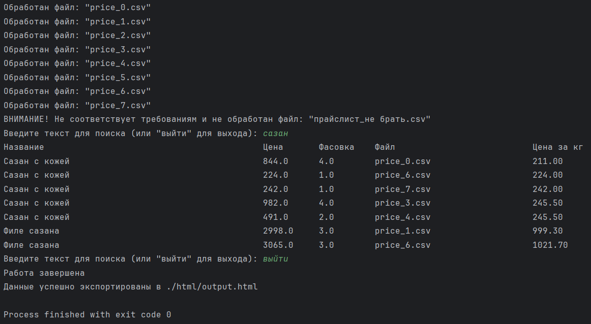

# Анализатор прайс-листов

**Анализатор прайс-листов** — это инструмент для анализа прайс-листов товаров. Он загружает данные из различных файлов, ищет товары по фрагменту названия и сортирует их по цене за килограмм по возрастанию. Также экспортирует список товаров в HTML файл для удобного просмотра.

## ➡️ Особенности

- Загружает данные прайс-листов из CSV файлов (с конкретными ключевыми словами в названии файла, например "price").
- Поддерживает CSV файлы с колонками для названия товара, цены и веса.
- Ищет товары по фрагменту названия, сортируя их по цене за килограмм.
- Экспортирует данные в HTML файл.
- Отображает результаты в удобном формате в терминале.

## ➡️ Установка
1. Клонируйте репозиторий:
```commandline
git clone https://github.com/Ninja2EatYa/price_list_analyser.git
cd price_list_analyser
```
2. Создайте виртуальное окружение:
```commandline
python -m venv venv
```
3. Активируйте виртуальное окружение:
- Windows:
```commandline
.\venv\Scripts\activate
```
- macOS/Linux:
```commandline
source venv/bin/activate
```
4. Установите необходимые зависимости:
```commandline
pip install -r requirements.txt
```
## ➡️ Использование
1. Поместите ваши файлы прайс-листов в папку price_lists/. Эти файлы должны содержать колонки для названия товара, цены и веса.
2. Запустите программу:
```commandline
python project.py
```
3. Программа отсканирует папку с прайс-листами, обработает файлы и позволит искать товары по фрагменту названия.
4. После поиска программа выведет результаты, отсортированные по цене за килограмм в терминале.
5. По желанию программа может экспортировать данные в HTML файл:
```commandline
python project.py --export
```
Это создаст файл с именем output.html в папке html/.
## ➡️ Пример использования


## ➡️ Структура файлов
```commandline
price_list_analyser/
├── html/               # Папка для экспортированных HTML файлов
│   └── output.html     # Экспортированный HTML файл с результатами анализа
├── price_lists/        # Папка, содержащая файлы прайс-листов (CSV)
│   ├── price_0.csv
│   ├── price_1.csv
│   └── ...
├── .gitignore          # Файл для игнорирования файлов и папок в Git
├── project.py          # Основной скрипт для загрузки и анализа прайс-листов
├── README.md           # Этот файл
└── requirements.txt    # Список зависимостей Python
```
## ➡️ Вклад
Если вы хотите внести свой вклад в проект, пожалуйста, сделайте форк репозитория и отправьте pull request с вашими изменениями.
## ➡️ Контакты
❓ Если у вас есть вопросы или предложения, пожалуйста, свяжитесь со мной по адресу 💌 [777jamesholden@gmail.com]()

[](https://github.com/Ninja2EatYa)